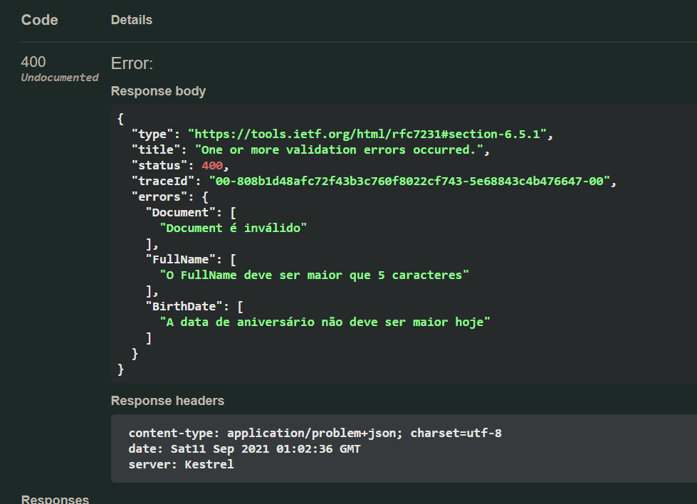

# Projeto Base sobre FluentValidation

Criador por Ellison W. M. Guimarães.

LinkedIn: https://www.linkedin.com/in/ellisonguimaraes/

E-mail: [ellison.guimaraes@gmail.com](mailto:ellison.guimaraes@gmail.com)


> Para este projeto além do *FluentValidation* foi utilizado *EntityFramework* (MYSQL) com padrão *repository* para acesso a banco de dados. 
>
> O banco de dados de nome `fvalidationdb` há somente uma única tabela:
>
> ```sql
> USE fvalidationdb;
> 
> CREATE TABLE `students` (
> 	`id` INT(11) NOT NULL AUTO_INCREMENT,
> 	`full_name` VARCHAR(100) NOT NULL DEFAULT '0',
> 	`birth_date` DATETIME NULL DEFAULT NULL,
> 	`document` VARCHAR(100) NOT NULL DEFAULT '0',
> 	`phone_number` VARCHAR(100) NOT NULL DEFAULT '0',
> 	`full_address` VARCHAR(130) NOT NULL DEFAULT '0',
> 	PRIMARY KEY (`id`)
> )
> ENGINE=InnoDB DEFAULT CHARSET=LATIN1;
> ```


# 1. O que é FluentValidation

O *FluentValidation* é uma biblioteca de validação para a plataforma .NET. O seu objetivo é de realizar a implementação de regras de validação de forma simples e rápida, baseando-se em métodos encadeados e expressões lambdas.

Para adicionar o *Fluent Validation* ao nosso projeto é necessário adicionar o pacote abaixo:

```C#
<PackageReference Include="FluentValidation.AspNetCore" Version="10.3.3" />
```

Ou através do comando via .NET CLI: `dotnet add package FluentValidation.AspNetCore --version 10.3.3`.


# 2. Criando um Validador

Para validarmos um objeto de um determinado tipo, é necessário implementar um validador para ele. Esse validador herda da classe `AbstractValidator<T>` onde `T` é a classe que deseja validar. 

No exemplo do código, vamos criar um validador para classe `Student` a seguir:

```C#
using System;
using System.ComponentModel.DataAnnotations;
using System.ComponentModel.DataAnnotations.Schema;

namespace FluentValidationNET5.Models
{
    [Table("students")]
    public class Student : BaseEntity
    {
        [Column("full_name")]
        public string FullName { get; set; }
        
        [Column("birth_date")]
        public DateTime BirthDate { get; set; }
        
        [Column("document")]
        public string Document { get; set; }
        
        [Column("phone_number")]
        public string PhoneNumber { get; set; }
        
        [Column("full_address")]
        public string FullAddress { get; set; }
    }
}
```

Agora criaremos a classe para validar esse tipo: iremos criar a classe `StudentValidator` que herdará de `AbstractValidator<Student>`. Vejamos a implementação da classe a seguir:

```C#
using System;
using FluentValidation;
using FluentValidationNET5.Models;

namespace FluentValidationNET5.Validators {
    
    public class StudentValidator : AbstractValidator<Student> {
        
        public StudentValidator() {
            RuleFor(s => s.FullName)
                .NotEmpty().WithMessage("O FullName não pode ser nulo")
                .MaximumLength(50).WithMessage("O FullName deve ser menor que 50 caracteres")
                .MinimumLength(5).WithMessage("O FullName deve ser maior que 5 caracteres");

            RuleFor(s => s.BirthDate)
                .LessThan(DateTime.Now.Date).WithMessage("A data de aniversário não deve ser futura");
            
            RuleFor(s => s.Document)
                .Must(d => d.IsValidDocument()).WithMessage("Document é inválido");
        }
    }
}
```

Observe que existe um construtor para a classe validadora, e ==é no construtor da classe validadora que são inseridas todas as regras de validação do objeto==. 


# 3. Regras de Validação

As regra de validação são feitas no construtor da classe validadora, através do método `RuleFor` e `RuleForEach`. 

> Utilizamos o `RuleForEach` quando o atributo da classe que está sendo validade é uma coleção (*Collection*). Veja o exemplo abaixo:
>
> Imagine uma classe `Person`: 
>
> ```C#
> public class Person {
> 	public List<string> AddressLines { get; set; } = new List<string>();
> }
> ```
>
> Para adicionar regras ao atributo `AddressLines` é necessário usar o `RuleForEach` já que o atributo é um *Collection*. Veja a classe validadora para `Person`, a `PersonValidator`:
>
> ```C#
> public class PersonValidator : AbstractValidator<Person> {
> 	public PersonValidator() {
> 		RuleForEach(x => x.AddressLines).NotNull();
> 	}
> }
> ```

Dentro do `RuleFor` (ou `RuleForEach`) informamos o atributo ao qual desejamos impor as regras, por exemplo, imagine que queiramos criar uma regra para o atributo `FullName` da classe `Student`, logo, o `RuleFor(a => a.FullName)`.

Para cada atributo atribuímos um `RuleFor` e em seguida inserimos as regras de validação. 

> Uma boa prática é colocar um `WithMessage` após cada regra de validação. O `WithMessage` é a mensagem que o usuário receberá caso não seja validado.

Podemos ver através do código que foram feitas regras de validações em três atributos:

- `FullName`. foram inseridos três regras ao atributo:
    - `NotEmpty()` o qual o atributo não pode ser vazio;
    - `MaximumLength(size)` o qual o atributo não pode ultrapassar o tamanho `size`;
    - `MinimumLength(size)` o qual o atributo precisa ter tamanho mínimo `size`.
- `BirthDate`. O qual foi inserido uma única regra:
    - `LessThan(DateTime.Now.Date)`: essa regra informa que a data informada precisa ser menor que a data atribuída no parâmetro.
- `Document`. O qual foi inserido uma única regra ==personalizada==. Falaremos de regras personalizadas no tópico abaixo.

> Na documentação do *FluentValidation* podemos ver todas as regras pré definidas pela biblioteca. Acesse pelo link a seguir: 
>
> ***Built-in Validators***: [https://docs.fluentvalidation.net/en/latest/built-in-validators.html](https://docs.fluentvalidation.net/en/latest/built-in-validators.html)


## 3.1. Regras Personalizadas

Para criar uma regra personalizada utilizamos o `.Must(predicate)`. Ele recebe um predicado do tipo `Func<T, bool> predicate` que recebe o tipo `T` do atributo enviado via `RulerFor`, e retorna um booleano. 

No exemplo do código usamos o `Must` para uma regra personalizada para o atributo `RuleFor(a => a.Document)`. O atributo `Document` de `Student` é do tipo `string`. Logo, o predicado do `Must` será do tipo `Func<string, bool> predicate`, que recebe a string `Document` e retorna um booleano.

O `Must` do exemplo recebe uma função lambda `d => d.IsValidDocument()`. O método `IsValidDocument` é um método estendido de `string`:

```C#
using System.Text.RegularExpressions;

namespace FluentValidationNET5 {
    public static class StringExtensions {
        public static bool IsValidDocument(this string document) {
            var expression = "[0-9]{3}\\.?[0-9]{3}\\.?[0-9]{3}\\.?[0-9]{2}";

            return Regex.Match(document, expression).Success;
        }
    }
}
```

> Essa expressão *Regex* é uma expressão que valida o CPF. No retorno é usado o método `Regex.Match` passando o `Document` e a expressão *Regex*. O `.Success` é um atributo que é `true` quando a string corresponde com o *Regex* e `false` quando não corresponde.

Logo, se no `Must` retornar `true` significa que é válido, se `false` invalida o objeto.


# 4. Usando os Validadores

## 4.1. De Forma Explícita

Podemos fazer chamada do validador explicitamente para fazer a validação. Para exemplificar, vamos fazer uma validação de forma explícita no método POST do `StudentController`:

```C#
[HttpPost]
public IActionResult Post([FromBody] Student student, [FromServices] IRepository<Student> repository)
{
    StudentValidator validator = new StudentValidator();

    ValidationResult result = validator.Validate(student);

    if (!result.IsValid) {
        result.Errors.ForEach(e => 
                              Console.WriteLine($"Property {e.PropertyName}, Erro: {e.ErrorMessage}"));
        return BadRequest("Objeto não é válido");
    }

    return Ok(repository.Create(student));
}
```

E vamos as seguintes observações:

- Na linha 4 criamos uma instancia do validador `StudentValidator validator`;

- Para validar um objeto do tipo `Student`, usamos o método `Validate()` onde passamos o objeto do tipo `Student`. Observe que o retorno é um objeto do tipo `ValidationResult`;

    > O `ValidationResult` pertence ao namespace `using FluentValidation.Results`.

- O `ValidateResult` tem dois atributos:

    - `IsValid` que se for `true` a validação está correta;
    - `Errors` que contém uma coleção de erros (uma para cada atributo com validação errada). Esse ainda tem vários atributos para identificar o erro. No código utilizamos dois:
        - `PropertyName` que retorna o nome do atributo o qual a validação deu incorreta;
        - E o `ErrorMessage` que é a mensagem do `WithMessage`;
        - Há varias outras propriedades.

### 4.1.1. Via Injeção de Dependências

Podemos ainda registrar o validador como Injeção de Dependência (DI), e desse forma, não precisamos instanciar ela sempre. Podemos injetar no método `ConfigureServices` da classe `Startup` da seguinte forma:

```C#
services.AddScoped<IValidator<Student>, StudentValidator>();
```

E poderíamos consumir essa injeção no construtor do *controller* ou no método POST como a seguir:

```C#
[HttpPost]
public IActionResult Post([FromBody] Student student, 
                          [FromServices] IRepository<Student> repository,
                          [FromServices] IValidator<Student> validator)
{
    ValidationResult result = validator.Validate(student);

    if (!result.IsValid) {
        result.Errors.ForEach(e => 
                              Console.WriteLine($"Property {e.PropertyName}, Erro: {e.ErrorMessage}"));
        return BadRequest("Objeto não é válido");
    }

    return Ok(repository.Create(student));
}
```


## 4.2. Registro Automático

Podemos fazer o registro automático do validador, mas o que seria isso? automaticamente o validador iria validar as entradas do tipo especificado. 

Podemos configurar através do método `ConfigureServices` presente na classe `Startup`:

```C#
services.AddControllers()
    .AddFluentValidation(config => config.RegisterValidatorsFromAssemblyContaining<StudentValidator>());
```

Usando o `AddControllers` adicionamos o `AddFluentValidation` e passamos as configurações por parâmetro. Como no exemplo só existe o validador `StudentValidator`, usamos somente um `RegisterValidatorsFromAssemblyContaining`.

A partir desse momento quando o *controller* receber um objeto será feita uma validação antes de iniciar o método da rota e retornará um erro ao *client*. Logo será removido do método POST toda a lógica de validação:

```C#
[HttpPost]
public IActionResult Post(  [FromBody] Student student, 
                          [FromServices] IRepository<Student> repository)
{
    return Ok(repository.Create(student));
}
```

Veja por exemplo ao tentar inserir um objeto inválido:



Automaticamente o *Fluent Validation* retorna um erro 400 para o *client* com as informações do erro no formato JSON.


# 5. Referências

[Documentação do Fluent Validation](https://docs.fluentvalidation.net/)

[.NET - Apresentando a Fluent Validation - YouTube](https://www.youtube.com/watch?v=mGXPXjxCqhA&ab_channel=JoseCarlosMacoratti)

[Talk #108 - Validações em .NET com FluentValidation - YouTube](https://www.youtube.com/watch?v=XHq6_cL5gA8&ab_channel=Pagar.meTalks)

[Luis Dev - FluentValidation Example - GitHub](https://github.com/luisdeol/fluent-validations-yb)

